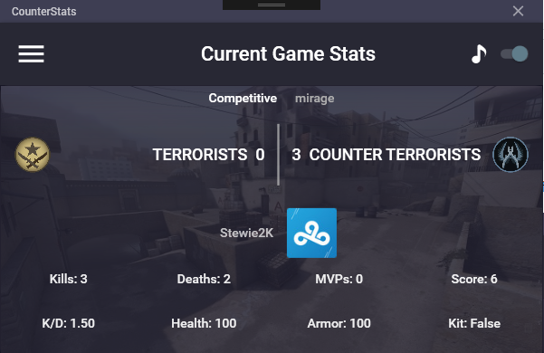

# CounterStats
CSGO Game State Integration Application to track statistics in a game (and a few other features)

## Current Features

- UI following material design with good aesthetic, including map overview & custom 'metro' (the area that includes the close icon)
- Displaying current game score and details (map, gametype)
- Tracking and displaying scoreboard stats for the current user
- Tracking and displaying additional gamestate stats (K/D, Health, Armor, Whether the user has a defuse kit)
- Fully featured installer, including adding a new configuration file into the current users
